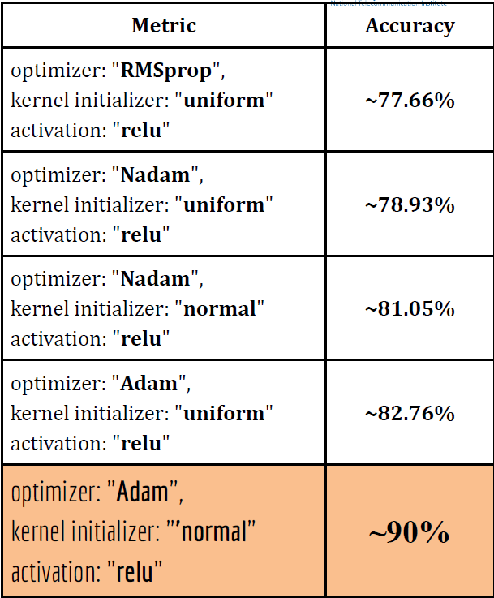

# Arabic OCR GUI Application
<p float="left">
  
  
</p>

## Table of Contents
- [Arabic OCR GUI Application](#arabic-ocr-gui-application)
  - [Table of Contents](#table-of-contents)
  - [Overview](#overview)
  - [Features](#features)
  - [System Requirements](#system-requirements)
  - [Installation](#installation)
  - [How to Use the GUI Application](#how-to-use-the-gui-application)
  - [Proposed Model versus the conventional One](#proposed-model-versus-the-conventional-one)
  - [Technical Details](#technical-details)
    - [OCR Pipeline](#ocr-pipeline)
    - [Performance Optimization](#performance-optimization)
  - [Proposed Customized Model](#proposed-customized-model)
    - [Used Dataset](#used-dataset)
    - [Our Target](#our-target)
    - [Model Architecture](#model-architecture)
    - [Model Workflow](#model-workflow)
    - [Model Summary](#model-summary)
    - [Hyperparameter Tuning](#hyperparameter-tuning)
    - [Proposed Customized Model Result](#proposed-customized-model-result)
  - [GUI Components](#gui-components)
  - [Development](#development)
    - [Project Structure](#project-structure)
    - [Coding Standards](#coding-standards)
  - [Troubleshooting](#troubleshooting)
  - [FAQ](#faq)
  - [Contributing](#contributing)
  - [License](#license)
  - [Acknowledgments](#acknowledgments)

## Overview

The Arabic OCR GUI Application is a sophisticated tool designed for Optical Character Recognition of Arabic text. Developed as part of the NTI Post Graduate Diploma 2023/2024, this application leverages advanced image processing techniques and machine learning models to accurately extract text from images containing Arabic script. The project is forked from **Hussein Youssef's [Arabic OCR](https://github.com/HusseinYoussef/Arabic-OCR)** and enhanced with our new code in a professional manner.


## Features

- **Intuitive GUI**: Built with Tkinter for a user-friendly experience
- **Multi-format Support**: Handles PNG, BMP, JPG, and JPEG image formats
- **Advanced OCR Engine**: Custom-built for Arabic script recognition
- **Adjustable Parameters**: Fine-tune word spacing for optimal segmentation
- **Intermediate Processing Visualization**: Option to save and view segmented images
- **Bilingual Interface**: Fully supports both English and Arabic
- **Multi-threaded Processing**: Utilizes multiprocessing for enhanced performance
- **Customizable Font Support**: Adaptable to various Arabic font styles

## System Requirements

- **Operating System**: Windows 10+, macOS 10.14+, or Linux (Ubuntu 18.04+)
- **CPU**: Quad-core processor, 2.5 GHz or higher
- **RAM**: Minimum 8 GB, 16 GB recommended
- **Storage**: At least 1 GB of free space
- **Python**: Version 3.7 or higher
- **GPU**: NVIDIA GPU with CUDA support (optional, for enhanced performance)

## Installation

1. Clone the repository:
   ```bash
   git clone https://github.com/salehmahmoud594/Arabic-OCR-master.git
   cd Arabic-OCR-master
   ```

2. Set up a virtual environment:
   ```bash
   python -m venv venv
   source venv/bin/activate  # On Windows, use `venv\Scripts\activate`
   ```

3. Install dependencies:
   ```bash
   pip install -r requirements.txt
   ```

4. Install additional system libraries (Linux only):
   ```bash
   sudo apt-get update
   sudo apt-get install libsm6 libxext6 libxrender-dev
   ```

## How to Use the GUI Application
1. **Open the Application**:
   - Run `python main.py` to start the Tkinter GUI application.

2. **Choose Photo**:
   - Click on the "Choose Photo" button to import an image file.
   - Supported formats include PNG, BMP, JPG, and JPEG.
   - 

3. **Display Image**:
   - The selected image will be displayed in the GUI.
   - 

4. **Clear Image**:
   - Click on the "Clear" button to remove the displayed image and reset the interface.
   - 

5. **Submit for OCR**:
   - Click on the "Submit" button to start the OCR process.
   - The processed text will be displayed in the output section.
   - 

6. **Language Selection**:
   - Use the language selection menu to switch between English and Arabic interfaces.
   - 

7. **Word Spacing Adjustment**:
   - Set the Font from Select the Font menu and word spacing in the "Word Space" entry to adjust the spacing between words.
   - 

8. **Save Image Segments**:
   - Check the "Save Image Segments" option to save the segmented characters as separate images.
   - 

## Proposed Model versus the conventional One

**Sample from our result Models**
   - 
   - 

## Technical Details

### OCR Pipeline


1. **Image Preprocessing**
   - Grayscale conversion
   - Noise reduction
   - Binarization using Otsu's method
   - Deskewing

2. **Text Line Segmentation**
   - Horizontal projection profile analysis
   - Connected component analysis for line separation

3. **Word Segmentation**
   - Vertical projection profile analysis
   - Dynamic spacing threshold based on font style

4. **Character Segmentation**
   - Contour detection
   - Morphological operations for character isolation

5. **Feature Extraction**
   - HOG (Histogram of Oriented Gradients) features
   - Zoning features

6. **Character Recognition**
   - Deep learning model: Convolutional Neural Network (CNN)
   - Model architecture: 3 convolutional layers, 2 max-pooling layers, 2 fully connected layers
   - Training dataset: Custom dataset of 4000 samples per character

7. **Post-processing**
   - Language model integration for context-aware corrections
   - Diacritics handling and normalization

### Performance Optimization

- Multi-threaded processing using Python's `multiprocessing` module
- Efficient memory management with NumPy arrays
- GPU acceleration for CNN inference (when available)

## Proposed Customized Model

### Used Dataset
- **Dataset**: [Link to Dataset](https://www.kaggle.com/datasets/salehmahmoud/all-char-samples)
- **Distribution Image**:
  

### Our Target
- Choose an appropriate model architecture.
- Tune the hyperparameters to select the best hyperparameter to help us design the model.
- Regularize the model to prevent overfitting and underfitting.
- Get the model with the best performance.
- Achieve the best validation accuracy.
- Minimize loss.

### Model Architecture


### Model Workflow


### Model Summary


### Hyperparameter Tuning
A grid search is conducted with the following parameters:
- **Optimizer**: ['RMSprop', '***Adam***', 'Adagrad', 'Nadam']
- **Kernel Initializer**: ['***normal***', 'uniform']
- **Activation**: ['relu']
- **Number of Epochs**: 5



### Proposed Customized Model Result
- **Metric**
  - **Final Model**
  - **Accuracy**: 95%
  - **Loss Value**: 0.251
  - **Precision**: 95%
  - **F1-score**: 95%
  - **Recall**: 95%

## GUI Components

- **Image Selection**: File dialog for choosing input images
- **Font Selector**: Dropdown menu with common Arabic font styles
- **Word Spacing Adjuster**: Slider for fine-tuning segmentation parameters
- **Segmentation Visualizer**: Toggle switch for saving intermediate results
- **Processing Status**: Progress bar indicating OCR pipeline stages
- **Text Output**: Scrollable text area for displaying recognized text
- **Language Switcher**: Button to toggle between English and Arabic interfaces

## Development

### Project Structure

```
arabic-ocr-gui/
├── src/
│   ├── character_segmentation.py
│   ├── chars.zip
│   ├── dataset.py
│   ├── edit

.py
│   ├── feature_extraction.py
│   ├── Main.py
│   ├── MainMod.py
│   ├── OCR.py
│   ├── preprocessing.py
│   ├── resizable_img.py
│   ├── segmentation.py
│   ├── spin.py
│   ├── train.py
│   ├── Try.py
│   └── utilities.py
├── bakTest/
│   ├── testing_images
│   └── ....
├── line/
│   └── ....
├── words/
│   └── ....
├── chars/
│   └── ....
└──  models/
│   ├── 1L_NN.sav
│   ├── 2L_NN.sav
│   ├── all-char-4k-samples-code-model.json (Our Customized Enhanced Model)
│   ├── all-char-4k-samples-code-model.weights.h5 (Our Customized Enhanced Model)
│   ├── char-4k-samples-code-model.json (Our Customized Enhanced Model)
│   ├── char-4k-samples-code-model.weights.h5 (Our Customized Enhanced Model)
│   ├── Enhanced_CNN_Compressed_Dataset.weights_50_Run.weights.h5 (Our Customized Enhanced Model)
│   ├── Enhanced_CNN_Compressed_Dataset_100_Run.sav (Our Customized Enhanced Model)
│   ├── Enhanced_CNN_Compressed_Dataset_50_Run.sav (Our Customized Enhanced Model)
│   ├── Gaussian_Naive_Bayes.sav
│   ├── LinearSVM.sav
│   └── model1.weights.h5 (Our Customized Enhanced Model)

```

### Coding Standards

- Follow PEP 8 guidelines for Python code style
- Use type hints for function arguments and return values
- Document classes and functions using Google-style docstrings

## Troubleshooting

Common issues and their solutions:

1. **Image loading fails**: Ensure the image file is not corrupted and in a supported format.
2. **OCR accuracy is low**: Try adjusting the word spacing or selecting a different font style.
3. **Application crashes during processing**: Check system resources and try processing a smaller image.

For more issues, consult the [FAQ](#faq) section or open an issue on GitHub.

## FAQ

1. **Q: What image size is optimal for OCR?**
   A: Images with a resolution of 300 DPI typically yield the best results.

2. **Q: Can the application handle handwritten Arabic text?**
   A: The current version is optimized for printed text. Handwriting support is planned for future releases.

3. **Q: How can I improve OCR accuracy for a specific font?**
   A: Select the closest matching font style in the GUI and fine-tune the word spacing parameter.

## Contributing

We welcome contributions! Please follow these steps:

1. Fork the repository
2. Create a feature branch: `git checkout -b feature/NewFeature`
3. Commit your changes: `git commit -am 'Add NewFeature'`
4. Push to the branch: `git push origin feature/NewFeature`
5. Submit a pull request

For major changes, please open an issue first to discuss the proposed changes.

## Acknowledgments

- NTI Post Graduate Diploma 2023/2024 faculty and staff
  - AI project supervised by Dr. Ghazal Abdelaty Fahmy
  - Team:
     - [Eng. Saleh Mahmoud](https://github.com/salehmahmoud594/)
     - Eng. Mohamed Samy
     - [Eng. Ahmed El Shawadfy](https://github.com/ahmedelshawadfy)
     - Eng. Asmaa Mohamed
     - Eng. Assem Ibrahim
     - Eng. Omar Mohamed
     - [Eng. Amany Abdeltawab](https://github.com/AmanyAli)
- Contributors to open-source libraries used in this project
- The Arabic OCR research community for their invaluable papers and resources
